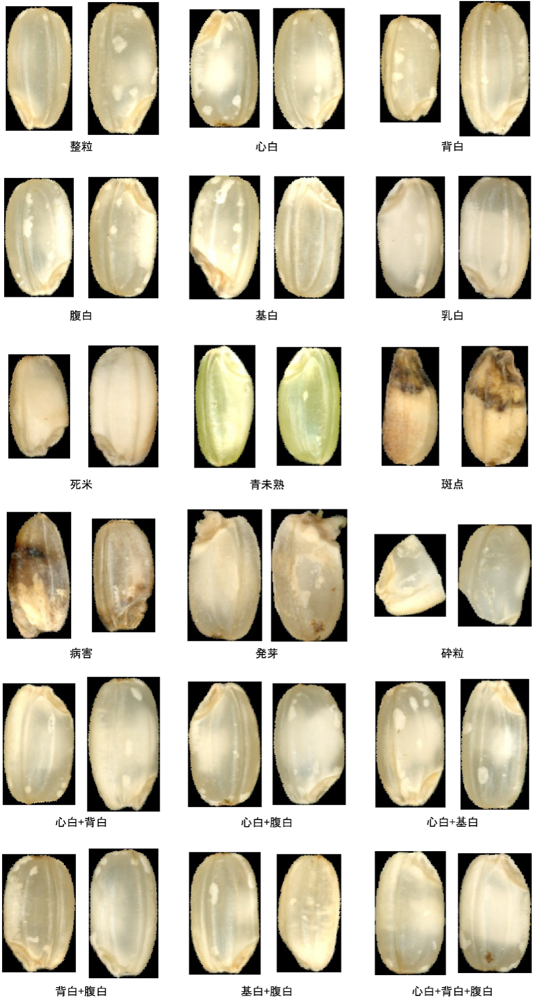
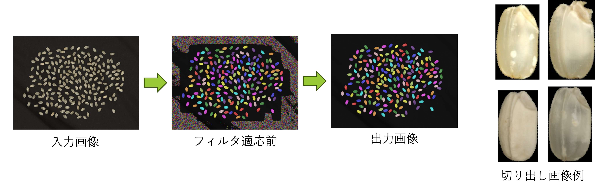
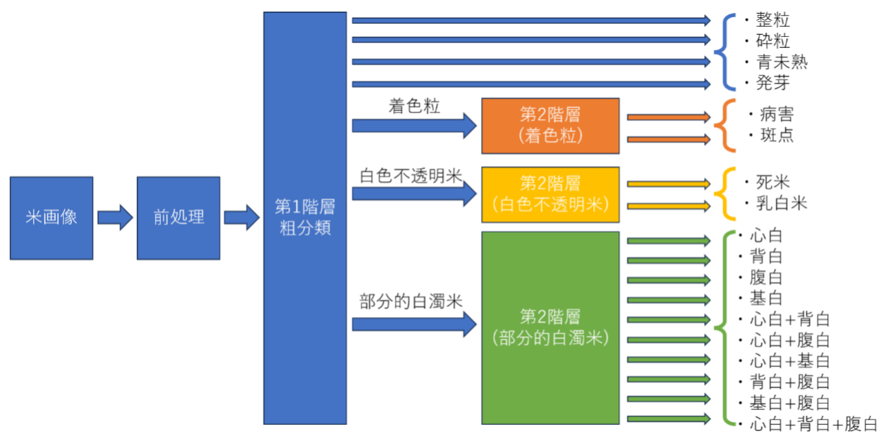
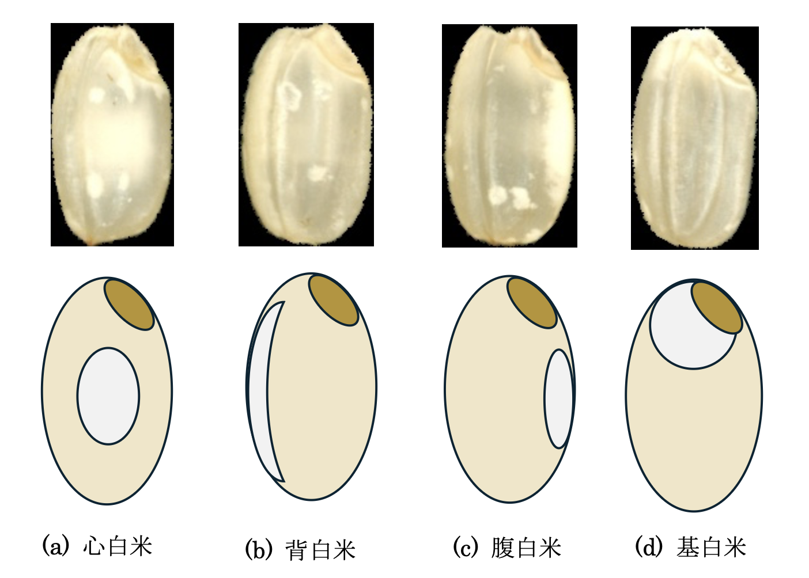
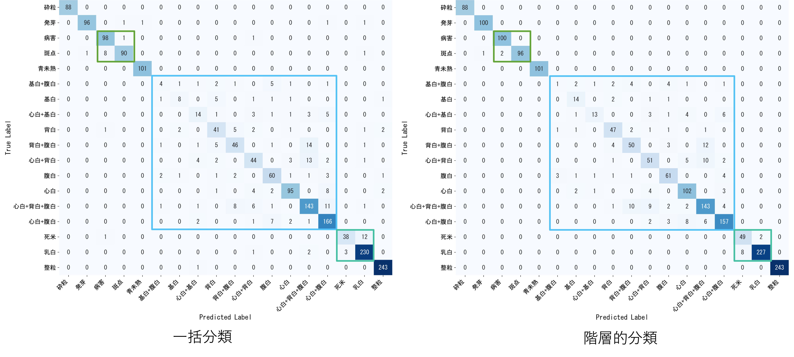

# Deep Learning-based Quality Inspection System for Sake Rice

本リポジトリは, 深層学習を用いた酒米（酒造好適米）の外観品質判定システムの自動化に関する研究および実装を公開するものです. 複雑な形質を持つ米粒の識別に対し, 階層的分類アプローチを用いることで, 実用レベルの判定精度を実現しました. 

> [!NOTE]
> 本研究は兵庫県立大学でのプロジェクトに基づいています. 現在, 指導教員により追加の実験および論文化の手続きが進められているため, 引用や転載についてはご留意ください. 

---

## 1. プロジェクト概要 (Project Overview)
酒米の品質検査は, 熟練の検査員による目視に依存しており, 後継者不足や判定のバラツキが課題となっています. 特に「心白」や高温障害による「白未熟粒」は視覚的に酷似しており, 従来の単純な多クラス分類モデルでは高い精度を得ることが困難でした. 


*Figure 1: Representative examples of 18 rice grain classes (全18クラスの形質例)*

本プロジェクトでは, 18種類に及ぶ複雑な形質を整理し, 2段階の意思決定プロセスを持つ**階層的分類システム**を導入することで, 現場の専門知見に即した高精度な自動判定を実現しました. 

## 2. 前処理パイプライン (Preprocessing Pipeline)
実用的な精度を確保するため, 高度なセグメンテーションと幾何学的正規化を組み合わせた前処理パイプラインを構築しました. 


*Figure 2: Automated grain extraction process using Cellpose (Cellposeを用いた個体抽出プロセス)*

* **個体抽出 (Segmentation)**: Cellposeを用いて, 接触した米粒を正確に分離. 
* **ノイズ除去 (Noise Reduction)**: 面積フィルタ（1500 pixel以下を除外）により砕粒片を排除. 
* **正規化 (Normalization)**: 楕円フィッティングにより全粒の向きを垂直に揃え, 背景をマスク処理（黒塗り）することで, テクスチャ情報の抽出に特化したデータを作成します. 

## 3. 技術的工夫 (Technical Highlights)

### 3.1 提案手法：階層的分類 (Hierarchical Classification)
全18クラスを一度に判定する一括分類（Flat Classification）の限界を突破するため, 判定プロセスを構造化しました. 


*Figure 3: Flat vs. Proposed Hierarchical Classification (一括分類と階層的分類の比較)*

* **第1階層：粗分類 (Coarse Classification)**: 視覚的類似性に基づき7カテゴリに統合. 大局的な特徴で誤判定を抑制. 
* **第2階層：精分類 (Fine Classification)**: 各カテゴリ専用の最適化モデル（ResNet-101等）を用いて詳細な識別を実施. 
* **論理的補正**: 物理的に共存し得ない形質の組み合わせを排除するマッピングロジックを実装し, ドメイン知識をモデルへ統合しました. 

### 3.2 難関クラスへの特化分析：部分的白濁米 (Partially Clouded Rice)
最も識別が困難な「部分的白濁米」カテゴリに対し, マルチラベル分類とドメイン知識による論理的補正を導入しました. 


*Figure 4: Detail analysis of partially clouded rice traits (部分的白濁米の形質詳細)*

* **マルチラベル学習**: 心白, 腹白, 背白, 基白の共存をシグモイド関数により判定. 
* **論理的補正**: 物理的にありえない形質の組み合わせを, ドメイン知識に基づくスコアリングロジックで排除. 

### 3.3 統計量変換（ジッタリング）によるドメイン適応
データ不足を解消するため, 豊富な食用米データを酒米ドメインへ適応させる統計量変換を採用しました. 

$$P_{out} = (P_{in} - Mean_{in}) \times \frac{Std_{target}}{Std_{in}} + Mean_{target}$$

## 4. 実験結果と成果 (Experimental Results)
階層的分類の導入により, 一括分類を大幅に上回る判定精度を達成しました. 


*Figure 5: Confusion matrix showing accuracy improvement (判定精度の検証結果)*

* **判定精度**: 識別が困難だった部分的白濁米において, 高いF1スコアを記録. 
* **ロバスト性**: 幾何学的正規化と背景マスク処理により, 撮影環境の変動に強いパイプラインを構築. 
* **実用性**: 農業センターの専門検査員の知見をアルゴリズムに組み込み, 社会実装に向けた技術的基盤を確立. 

## 5. 技術スタック (Tech Stack)
* **Language**: Python 3.10
* **Deep Learning**: PyTorch, Torchvision (ResNet-101, EfficientNet-B2)
* **Computer Vision**: OpenCV, Scikit-image, Cellpose
* **Data Analysis**: Pandas, Matplotlib, Openpyxl

## 6. リポジトリ構成 (Repository Structure)
現在, 研究用コードを公開用にリファクタリング中です. 整備が完了したものから順次公開します. 
(Currently refactoring research notebooks for public release. High-quality implementations will be released sequentially.)

```text
.
├── docs/               # 論文PDF等のドキュメント
│   └── images/         # README用画像
├── notebooks/          # 実験・解析用ノートブック (Refactoring...)
│   ├── 01_Preprocessing_Cellpose.ipynb   [Release Pending]
│   ├── 02_Domain_Adaptation.ipynb        [Release Pending]
│   ├── 03_Training_MultiLabel.ipynb      [Release Pending]
│   └── 04_Comprehensive_Analysis.ipynb   [Release Pending]
├── src/                # 推論パイプラインの実装モジュール
│   └── sake_rice_inspection_system.py    [Available]
├── requirements.txt    # 環境依存ライブラリ
└── README.md           # 本ドキュメント
```

## 7. 免責事項・データ取り扱い (Disclaimer)
* **データ機密性**: 本研究で使用した画像データセットは, 兵庫県立農林水産総合技術センターおよび兵庫県立工業技術センターの所有物であり, 機密保持契約（NDA）に基づいています. そのため, データセット自体は本リポジトリに含まれません. 
* **論文全文の閲覧について**: 上記の機密保持および今後の論文化の手続きのため, 論文全文の一般公開は控えております. 内容の詳細や閲覧にご興味のある採用担当者・研究者の方は, 下記の連絡先まで個別にお問い合わせください. 

---

## 8. お問い合わせ (Contact)
論文全文の閲覧希望や技術的な詳細に関するご質問は, 以下までお願いいたします. 
* **Email**: [s.migaku1010@icloud.com]

---

### 謝辞
本研究の遂行にあたり, 多大なるご指導を賜りました兵庫県立大学 准教授 森本雅和先生, ならびに貴重なデータと専門的知見を提供してくださった兵庫県立農林水産総合技術センター, 兵庫県立工業技術センターの皆様に深く感謝申し上げます.
